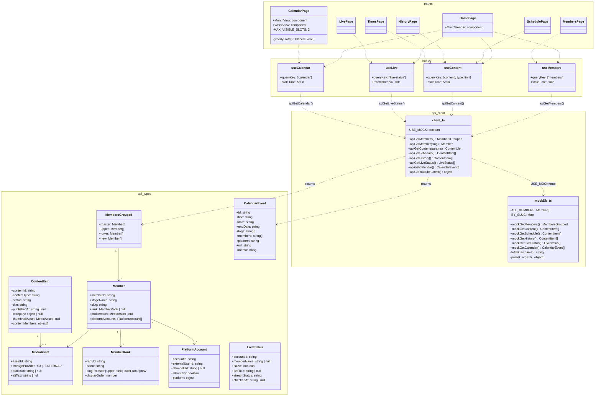

# GGU-CASTLE Frontend — `grx/`

꾸한성(GGU-CASTLE) 공식 팬사이트 프론트엔드. React 18 + Vite 5 + TypeScript SPA.

---

## 폴더 구성

```
grx/
├── index.html                  # Vite 진입점 (div#root)
├── vite.config.ts              # 빌드 설정 + dev proxy (/api → :3000)
├── package.json
│
├── public/                     # 정적 에셋 (빌드 시 그대로 복사)
│   ├── img/                    # 멤버 프로필 이미지
│   ├── img2/                   # 멤버 보조 이미지
│   ├── rika/                   # 리카 팬페이지 전용 이미지·오디오
│   └── mock/                   # Mock DB용 CSV 파일 5종
│       ├── grx - Times.csv     # 꾸창뉴스 기사 (NEWS)
│       ├── grx - Schedule.csv  # SOOP 방송공지 (SCHEDULE)
│       ├── grx - History.csv   # 게임 수상 내역 (GAME_EVENT)
│       ├── grx - Live.csv      # 라이브 상태 스냅샷
│       └── grx - Gallery.csv   # 갤러리 URL 목록
│
├── src/
│   ├── main.tsx                # ReactDOM.createRoot → App
│   ├── App.tsx                 # RouterProvider 마운트
│   ├── router.tsx              # createBrowserRouter — 라우트 선언
│   │
│   ├── api/                    # 데이터 계층
│   │   ├── types.ts            # 백엔드 응답 타입 정의 (인터페이스)
│   │   ├── client.ts           # API 함수 모음 + mock 전환 스위치
│   │   └── mockDb.ts           # CSV 기반 Mock 구현체
│   │
│   ├── hooks/                  # TanStack Query 훅
│   │   ├── useMembers.ts
│   │   ├── useContent.ts       # useNews / useSchedule / useHistory / useYoutubeLatest
│   │   ├── useLive.ts
│   │   └── useCalendar.ts
│   │
│   ├── components/
│   │   └── Layout.tsx          # Navbar + Footer + Lenis 스크롤 래퍼
│   │
│   ├── pages/
│   │   ├── HomePage.tsx        # 홈 (인트로 게이트 · 라이브 · 미니캘린더 · 뉴스 · 멤버슬라이더)
│   │   ├── MembersPage.tsx     # 계급별 멤버 그리드 + 상세 모달
│   │   ├── LivePage.tsx        # 실시간 라이브 대시보드
│   │   ├── SchedulePage.tsx    # SOOP 방송공지 목록
│   │   ├── CalendarPage.tsx    # Notion 연동 인터랙티브 캘린더
│   │   ├── HistoryPage.tsx     # 게임 수상·명예의 전당
│   │   ├── TimesPage.tsx       # 꾸한타임즈 뉴스
│   │   ├── LikaPage.tsx        # 리카 팬페이지 (이스터에그 진입)
│   │   └── MaintenancePage.tsx # 점검 중 플레이스홀더
│   │
│   └── styles/
│       └── global.css          # 전역 CSS 변수 · 공통 클래스
│
└── legacy/                     # 리팩토링 이전 Vanilla HTML (참조용)
```

---

## 코드 아키텍처

### 계층 다이어그램

```
┌─────────────────────────────────────────────────────────────┐
│                        Browser                              │
└─────────────────────────┬───────────────────────────────────┘
                          │ HTTP
          ┌───────────────┴───────────────┐
          │         Vite Dev Server        │
          │   proxy: /api → :3000          │
          └───────────────┬───────────────┘
                          │
┌─────────────────────────▼───────────────────────────────────┐
│                    React SPA (grx/)                         │
│                                                             │
│  main.tsx → App.tsx → RouterProvider                        │
│                │                                            │
│         ┌──────▼──────┐                                     │
│         │   Layout    │  Navbar · Footer · Lenis scroll     │
│         └──────┬──────┘                                     │
│                │ <Outlet>                                    │
│         ┌──────▼──────────────────────────────┐            │
│         │            Pages                     │            │
│         │  Home · Members · Live · Schedule    │            │
│         │  Calendar · History · Times · Lika   │            │
│         └──────┬──────────────────────────────┘            │
│                │ useQuery()                                  │
│         ┌──────▼──────┐                                     │
│         │    Hooks     │  TanStack Query (cache · stale)    │
│         │ useMembers   │  useContent · useLive              │
│         │ useCalendar  │                                     │
│         └──────┬──────┘                                     │
│                │                                            │
│         ┌──────▼──────┐   VITE_MOCK=true                   │
│         │  client.ts   │ ──────────────► mockDb.ts          │
│         │  API 함수    │                (CSV 파싱)           │
│         └──────┬──────┘                                     │
└────────────────│────────────────────────────────────────────┘
                 │ fetch /api/*
         ┌───────▼───────┐
         │  NestJS :3000  │  (backend/)
         └───────────────┘
```

### 클래스 다이어그램



---

## 설계 근거

### 1. React + Vite SPA — 왜 SPA로 전환했나

기존 Vanilla 구조에서는 nav/footer 마크업이 모든 `.html` 파일에 복붙되어 있었고, 같은 라이브·히스토리 화면이 두 개의 폴더에 이중으로 존재했다. SPA 전환으로 공통 레이아웃을 `Layout.tsx` 하나로 통합하고 중복 파일을 제거했다. Vite는 ES Module 기반 HMR로 빠른 개발 피드백을 제공하며, Rollup 번들링으로 프로덕션 성능을 확보한다.

### 2. 계층 분리 (api → hooks → pages)

| 계층 | 역할 | 설계 근거 |
|------|------|-----------|
| `types.ts` | 타입 계약 | 백엔드 응답과 프론트 컴포넌트 사이의 계약을 단일 파일로 관리. 타입 변경 시 파급 범위를 한눈에 파악. |
| `client.ts` | 네트워크 호출 | fetch 로직을 훅·페이지에서 분리. Mock 전환 스위치를 이 파일 한 곳에만 둔다. |
| `mockDb.ts` | CSV Mock | 백엔드 없이 프론트를 단독으로 실행하고 테스트할 수 있다. |
| `hooks/` | 캐시·상태 관리 | TanStack Query가 stale-while-revalidate, refetchInterval, 요청 중복 제거를 담당. 페이지 컴포넌트는 데이터 페칭 로직을 직접 다루지 않는다. |
| `pages/` | UI | 데이터 소비와 렌더링만 담당. 비즈니스 로직이 섞이지 않는다. |

### 3. Mock 데이터 전략 — 빌드 시 zero-cost

`/public/mock/*.csv` 파일은 Vite dev server가 정적으로 서빙하므로 별도 서버 없이 `fetch('/mock/...')` 로 런타임에 읽는다. 빌드 시 `VITE_MOCK` 환경변수 미설정 → `import.meta.env.VITE_MOCK`이 `'false'`로 정적 치환 → `if (USE_MOCK)` 분기가 dead-code → Rollup tree-shaking으로 `mockDb.ts` 전체가 프로덕션 번들에서 제거된다.

```
개발: VITE_MOCK=true → mockDb.ts 활성화 (CSV 파싱, 백엔드 불필요)
배포: VITE_MOCK 미설정 → client.ts의 fetch('/api/*') 경로만 번들에 포함
```

### 4. CalendarPage 이벤트 스패닝 — 두 레이어 + Greedy Scheduling

Notion DB에는 `date`와 `endDate`가 있어 다중일 이벤트(예: 삼국지 서버, 모야 제주도)가 존재한다. 단순히 날짜마다 badge를 찍는 방식은 연속 블록 표현이 불가능하다.

**Greedy Interval Scheduling** — 이벤트를 시작일 오름차순으로 정렬한 뒤, 각 이벤트를 현재 점유 중인 슬롯과 겹치지 않는 가장 낮은 row에 배치한다. 이 알고리즘은 O(n log n) 정렬 후 O(n·k) 배정(k = 최대 슬롯 수)으로 캘린더 뷰 규모에 충분히 빠르다.

**CSS Grid 오버레이 (두 레이어 구조)**

```
Layer 1 (배경, z-index: 1)
  └─ 날짜 숫자 셀 7개 (클릭 → DayModal)
       position: absolute, 전체 영역 커버

Layer 2 (이벤트 오버레이, z-index: 2, pointer-events: none)
  └─ 이벤트 카드
       grid-column: startCol / span length  ← 날짜 경계를 넘어 연장
       grid-row: slotIndex                  ← greedy 배정 결과
       pointer-events: auto                 ← 카드 클릭만 허용
```

Layer 분리로 날짜 셀 클릭과 이벤트 카드 클릭의 이벤트 충돌을 방지한다.

**+N개 오버플로우 버튼** — `MAX_VISIBLE_SLOTS = 2` 초과 시 각 날짜 열마다 `hiddenPerCol`을 집계해 해당 열에만 `+N개` 버튼을 `grid-row: MAX_VISIBLE_SLOTS + 1`에 배치. 클릭 시 해당 날짜의 DayModal을 열어 전체 목록을 표시한다.

### 5. Vite Proxy — CORS 없는 개발 환경

`vite.config.ts`에서 `/api/*` 요청을 `http://localhost:3000`으로 프록시해 CORS 설정 없이 백엔드와 통신한다. 브라우저 관점에서는 동일 origin(`localhost:5173`)이므로 preflight 요청이 발생하지 않는다. 프로덕션에서는 Nginx 또는 CloudFront가 동일한 경로 규칙으로 정적 SPA와 NestJS를 연결한다.

---

## 개발 실행

```bash
# Mock 모드 (백엔드 불필요)
VITE_MOCK=true npm run dev

# 실제 백엔드 연동
cd ../backend && npm run start:dev   # 터미널 1
npm run dev                          # 터미널 2
```

| 환경변수 | 값 | 설명 |
|----------|-----|------|
| `VITE_MOCK` | `true` | CSV Mock 모드 활성화 (프로덕션 빌드 시 tree-shake) |
| (없음) | — | `/api/*` → `localhost:3000` Vite 프록시 사용 |

## 라우트 맵

| 경로 | 페이지 | 주요 훅 |
|------|--------|---------|
| `/` | HomePage | useMembers · useLive · useNews · useCalendar |
| `/members` | MembersPage | useMembers |
| `/live` | LivePage | useLiveStatus |
| `/schedule` | SchedulePage | useSchedule |
| `/calendar` | CalendarPage | useCalendar |
| `/history` | HistoryPage | useHistory |
| `/times` | TimesPage | useNews |
| `/lika` | LikaPage | — |
| `/maintenance` | MaintenancePage | — |
